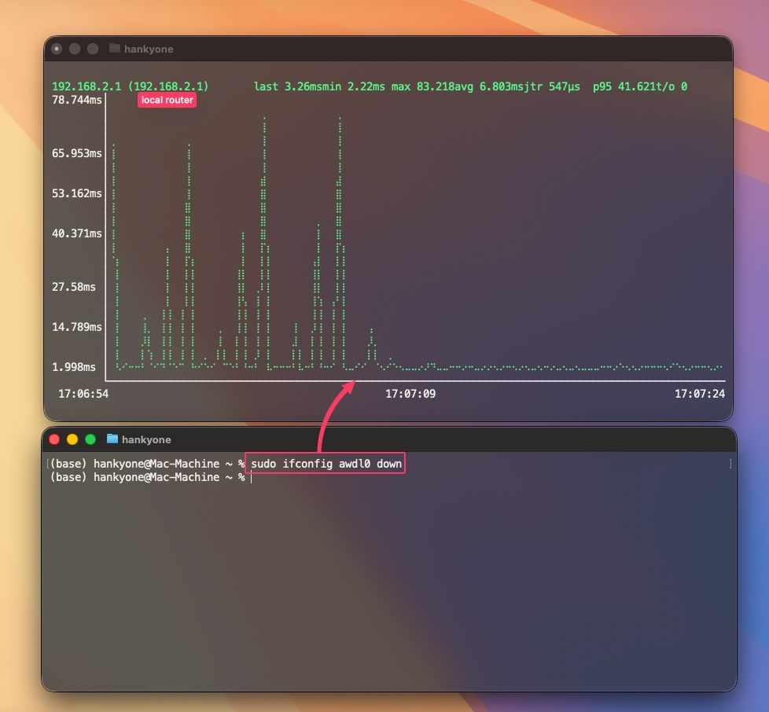

# WiFi Boost

A simple macOS menu bar app that reduces Wi-Fi latency by disabling AWDL (Apple Wireless Direct Link).



## What is AWDL?

AWDL is Apple's proprietary protocol that enables AirDrop, AirPlay, Handoff, Universal Clipboard, and Sidecar. It works by periodically hopping your Wi-Fi chip to a different channel to discover nearby Apple devices.

**The problem:** This channel hopping causes latency spikes of 50-100ms+ on your Wi-Fi connection, which is noticeable during video calls, gaming, or any real-time application.

**The solution:** Disabling AWDL eliminates these spikes, giving you consistent low-latency Wi-Fi.

## Features

- **One-click toggle**: Left-click the menu bar icon to enable/disable boost mode
- **Visual indicator**: Green bolt = boosted (low latency), Gray bolt = normal
- **Auto-restore**: Right-click menu option to automatically re-apply boost if the system re-enables AWDL
- **Status monitoring**: Polls every 2 seconds to keep the icon in sync with actual system state

## Trade-offs

When WiFi Boost is enabled (AWDL disabled), these features stop working:
- AirDrop
- AirPlay to Apple TV (may still work via mDNS on same network)
- Handoff
- Universal Clipboard
- Sidecar (wireless)
- Universal Control

Regular Wi-Fi, iCloud sync, and iMessage continue to work normally.

## Installation

### Option 1: Download the App (Recommended)

1. Download `WiFi-Boost.zip` from the [Releases](../../releases) page
2. Unzip and move `WiFi Boost.app` to your Applications folder
3. **Important**: Set up passwordless sudo (see below)
4. Launch the app

### Option 2: Build from Source

```bash
# Clone the repo
git clone https://github.com/YOUR_USERNAME/wifi-boost.git
cd wifi-boost

# Generate Xcode project and build
xcodegen generate
xcodebuild -project "WiFi Boost.xcodeproj" -scheme "WiFi Boost" -configuration Release build

# The app will be in ~/Library/Developer/Xcode/DerivedData/WiFi_Boost-*/Build/Products/Release/
```

### Required: Passwordless Sudo Setup

The app needs to run `ifconfig awdl0 up/down` which requires sudo. To avoid password prompts:

1. Create a sudoers file:
```bash
sudo visudo -f /etc/sudoers.d/awdl
```

2. Add this line (replace `YOUR_USERNAME` with your macOS username):
```
YOUR_USERNAME ALL=(root) NOPASSWD: /sbin/ifconfig awdl0 down
YOUR_USERNAME ALL=(root) NOPASSWD: /sbin/ifconfig awdl0 up
```

3. Save and exit (Ctrl+X, then Y, then Enter in nano)

4. Test it works without password:
```bash
sudo ifconfig awdl0 down  # Should not prompt for password
sudo ifconfig awdl0 up    # Should not prompt for password
```

## Usage

- **Left-click**: Toggle boost on/off
- **Right-click**: Open menu with options:
  - **Keep Boosted (Auto-restore)**: Automatically re-disable AWDL if the system turns it back on
  - **Quit**: Exit the app

## Launch at Login

To have WiFi Boost start automatically:

1. Open **System Settings** → **General** → **Login Items**
2. Click **+** and add WiFi Boost from your Applications folder

## Requirements

- macOS 14.0 (Sonoma) or later
- Passwordless sudo configured for ifconfig commands

## How It Works

WiFi Boost toggles the AWDL network interface:
- `sudo ifconfig awdl0 down` - Disables AWDL, stops channel hopping, reduces latency
- `sudo ifconfig awdl0 up` - Re-enables AWDL, restores AirDrop/Handoff functionality

The app monitors the interface state every 2 seconds and updates the menu bar icon accordingly.

## License

MIT License - feel free to use, modify, and distribute.

## Acknowledgments

- Inspired by the discovery that AWDL causes Wi-Fi latency issues on macOS
- Built with SwiftUI and AppKit
